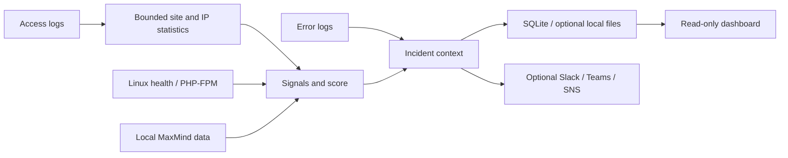

<p align="center">
  
</p>

<h1 align="center">ReqSentry</h1>
<p align="center"><strong>Understand suspicious web traffic. Keep the evidence.</strong></p>
<p align="center">Live access-log monitoring · Explainable scores · Local incident history</p>
<p align="center">
  <a href="#see-it-in-action">Walkthrough</a> ·
  <a href="#try-the-demo">Try the demo</a> ·
  <a href="configs/example.yaml">Configuration</a> ·
  <a href="docs/install.md">Linux installation</a> ·
  <a href="docs/review.md">Review notes</a> ·
  <a href="LICENSE">MIT license</a>
</p>

ReqSentry follows web-server logs in real time, groups requests by client and site, and turns suspicious behavior into scored incidents. Investigate the request patterns, server impact, network context, and correlated errors behind each decision from one dashboard.

**V1 is monitor-only.** `WOULD_BLOCK` means the evidence meets the configured review threshold. ReqSentry does not block requests, change firewall or web-server rules, or call an enforcement provider.

## See it in action

<p align="center">
  <a href="docs/images/dashboard-walkthrough.gif"></a>
</p>

Follow live traffic into a site, investigate a client, inspect its score and error context, then search the incident's saved requests.

**All media uses synthetic data:** 60 fictional IPv4/IPv6 clients across four reserved example sites. Country/ASN labels come from a generated demonstration MMDB, and PHP-FPM counters come from a local fixture endpoint. Scores, request samples, correlation, storage, search, and dashboard updates run through the real application. No production logs or credentials are included, and no traffic is sent to these client IPs. A country label is context, not a scoring rule or a claim about a real IP owner.

<table>
  <tr>
    <td><a href="docs/images/dashboard-overview.png"></a><br><strong>Live overview</strong><br>Traffic, errors, resource usage, and decisions across sites.</td>
    <td><a href="docs/images/dashboard-ip-investigation.png"></a><br><strong>IP investigation</strong><br>Network context, request patterns, and saved scoring evidence.</td>
  </tr>
  <tr>
    <td><a href="docs/images/dashboard-incident.png"></a><br><strong>Explainable incidents</strong><br>Review the signals and evidence behind a decision.</td>
    <td><a href="docs/images/dashboard-incident-logs.png"></a><br><strong>Focused log search</strong><br>Search saved incident requests without indexing every access log.</td>
  </tr>
</table>

## What it does

| Capability | What you can investigate |
| --- | --- |
| **Live monitoring across sites** | Follow multiple Nginx/Apache combined, JSON, logfmt, or mapped ECS log sources; spot clients reaching several virtual hosts. |
| **Explainable scoring** | Inspect 404 rates/diversity, path/query enumeration, method scans, burst/sustained rates, User-Agents, redirects, request cost, and server impact. Every incident retains its signal weights and ruleset version. |
| **Error correlation** | Associate web-server/application failures using request IDs, trace IDs, client/path/time, or site/server context. Association strength is labeled; errors alone do not increase a score. |
| **Incident request search** | Save up to five normalized requests per incident. Filter by server, site, IP, method, status, date, path, or request ID and follow the original score. Queries are omitted from saved request samples. |
| **Server and application context** | Sample Linux CPU/load/memory, optionally poll local PHP-FPM pools, and enrich clients from local MaxMind databases. Missing or stale values stay unavailable. |
| **Optional notifications** | Route incidents and recurring operational alerts to Slack, Microsoft Teams Workflows, or AWS SNS, with independent filters, cooldowns, bounded queues, and retries. |
| **Local history and recovery** | Store SQLite incidents and minute history, optional JSONL/operational files, rotation-aware log positions, and opt-in bounded crash recovery. |
| **Controlled retention** | Default to **four days** for investigation history and ReqSentry's configured output files. Increase or decrease the shared ceiling in configuration. |

The dashboard is read-only, embedded in the Go binary, and supports site/IP/network exploration, HTTP analytics, health views, incident filters, and live updates. It requires no separate database service or frontend runtime.



## How to read a score

Default decision thresholds are configurable:

| Decision | Score | Meaning |
| --- | ---: | --- |
| `NORMAL` | Below 30 | No saved incident under the default rules. |
| `WATCH` | 30–59 | Behavior worth watching. |
| `SUSPICIOUS` | 60–79 | Evidence needs investigation. |
| `WOULD_BLOCK` | 80–100* | Meets the monitor-only blocking review threshold. |

\* `WOULD_BLOCK` also requires a strong signal or signals from at least two behavioral groups. A high score without that corroboration remains `SUSPICIOUS`. Scores summarize configured detection evidence; they are not probabilities. A network or country is not deemed malicious because one client generated an incident.

In the demo, `203.0.113.31` has fictional Germany/hosting metadata and repeatedly enumerates numeric paths with non-GET 404s. Its saved site incident reaches `WOULD_BLOCK` using the default rules. Normal browser clients are present alongside less severe incidents; decisions are calculated, not inserted into the database.

## Try the demo

With **Go 1.26+** and **Python 3.9+**, from the repository root:

```sh
python3 scripts/demo.py
```

Open **[localhost:18092](http://localhost:18092)**. Allow 30 seconds for the first scored windows and about two minutes for traffic trends. The demo runs for five minutes; Ctrl+C stops it. It builds the daemon, creates fresh synthetic log files, and starts a local PHP-FPM status fixture. Everything generated stays in Git-ignored `dev-data/demo/`.

```sh
# Longer review session or an alternative port:
python3 scripts/demo.py --duration 900 --port 18095
```

Use Linux for live CPU/load/memory metrics. Other hosts can exercise the log pipeline and dashboard while unsupported host measurements remain unavailable. See [demo setup and verification](docs/demo.md) for traffic patterns, isolation, and capture details.

### Exercise real Nginx with Docker

Docker Compose provides four local Nginx sites, ReqSentry, and k6 traffic generation:

```sh
docker compose up -d --build
docker exec reqsentry-k6 k6 run /scripts/scenarios/normal.js
docker exec reqsentry-k6 k6 run /scripts/scenarios/cross-site.js
```

Open the **[dashboard](http://localhost:8090)** and the example sites: [shop.example](http://localhost:8081), [api.example](http://localhost:8082), [docs.example](http://localhost:8083), and [blog.example](http://localhost:8084). These are local labels; no DNS setup is needed. Ports bind to host loopback, and generated logs/state persist under Git-ignored `dev-data/`.

The standard Compose fixture uses the actual k6 source IP. The synthetic walkthrough demo deliberately supplies many fictional identities. See [development operations](docs/development.md) and [all k6 scenarios](tests/k6/README.md).

## Configure and run on Linux

Start with the [installation guide](docs/install.md) and [complete commented configuration reference](configs/example.yaml). Required settings stay active; optional features can be enabled by uncommenting their settings and parent blocks.

```sh
go build -o reqsentry ./cmd/reqsentry
./reqsentry -config /etc/reqsentry/config.yaml config test
./reqsentry -config /etc/reqsentry/config.yaml
```

After configuring paths, service permissions, and optional integrations, use the included [systemd service](deploy/reqsentry.service). The dashboard is disabled by default; enable it with an explicit access policy. Webhook URLs, passwords, and license keys belong in environment variables or systemd credentials, with only their reference names in YAML.

To change the shared retention ceiling:

```yaml
database:
  path: /var/lib/reqsentry/reqsentry.db
  retention:
    max_age: 96h # Four days; 48h = two days, 240h = ten days.
```

Original input logs, external backups, journald copies, and messages already delivered to Slack/Teams/SNS have separate retention. Cleanup is periodic and can lag under storage failures; reads immediately exclude expired history. See [storage and retention](docs/storage-output.md).

### Analyze existing logs

Use `replay` to analyze an existing access log, including requests recorded before ReqSentry was running. Preview a few records or replay the historical log without starting the daemon or sending notifications:

```sh
reqsentry -config /etc/reqsentry/config.yaml -limit 20 preview /var/log/app/access.jsonl
reqsentry -config /etc/reqsentry/config.yaml replay /var/log/nginx/access.log
```

Replay evaluates recorded timestamps with the detection rules and prints JSON incidents with their scores, followed by a summary. Results go to the terminal and are not imported into dashboard history. Historical server-health measurements are not reconstructed, and MaxMind enrichment is disabled during replay, so scores can differ from live monitoring. Configure the format/profile for structured sources before replaying them; see [replay formats and limits](docs/structured-logs.md#preview-replay-and-limits).

## Verification and scope

The fresh race-checked Go suite and static checks pass. Tests cover parser equivalence, proxy trust, bounded aggregation, scoring, error correlation, search isolation, four-day retention, rotation, restart/crash recovery, dashboard access controls, and notification contracts. The README walkthrough is captured from the running Linux demo; [review notes](docs/review.md) record its checks.

**Ready for a monitor-only product review; production validation remains open.** Representative production-log false-positive review and sustained resource measurements on the intended Linux host are still required. Slack/Teams/SNS provider contracts are tested with fake transports; a real workflow/topic/subscriber must be smoke-tested for the intended account. See [validation status](docs/validation.md).

## Documentation

| Topic | Guide |
| --- | --- |
| Demo walkthrough and review evidence | [Demo](docs/demo.md) · [Review notes](docs/review.md) |
| Linux installation and service operations | [Install](docs/install.md) |
| Every supported configuration setting | [Configuration reference](configs/example.yaml) |
| Dashboard access, API, and data semantics | [Dashboard](docs/dashboard.md) |
| Nginx/Apache and structured log formats | [Access logs](docs/access-logs.md) · [JSON/logfmt/ECS](docs/structured-logs.md) |
| Web/application error evidence | [Error correlation](docs/error-correlation.md) |
| Slack, Teams Workflows, and AWS SNS | [Notifications](docs/notifications.md) |
| Request samples and local retention | [Incident logs](docs/incident-logs.md) · [Storage](docs/storage-output.md) |
| Optional enrichment and pool health | [MaxMind](docs/maxmind.md) · [PHP-FPM](docs/php-fpm.md) |
| Development, components, and implementation work | [Development](docs/development.md) · [Architecture](docs/architecture.md) · [Tickets](Tickets/README.md) |
| Test evidence and production review requirements | [Validation](docs/validation.md) |

For code changes, run `go test -race ./...` and `go vet ./...`. Keep production logs, credentials, licensed databases, private configuration, and generated review artifacts outside Git. Published screenshots in `docs/images/` intentionally contain only synthetic demo data.

## License

ReqSentry is licensed under the [MIT License](LICENSE). Third-party dependencies and fixtures retain their respective licenses and notices.
