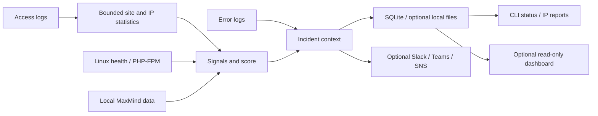
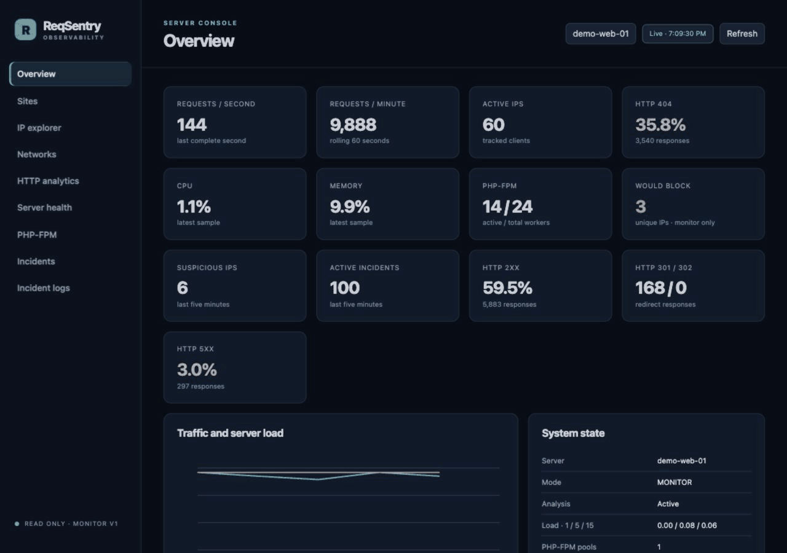
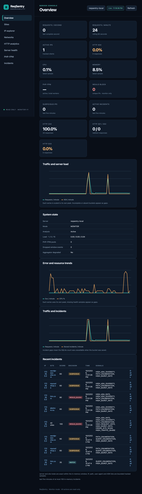
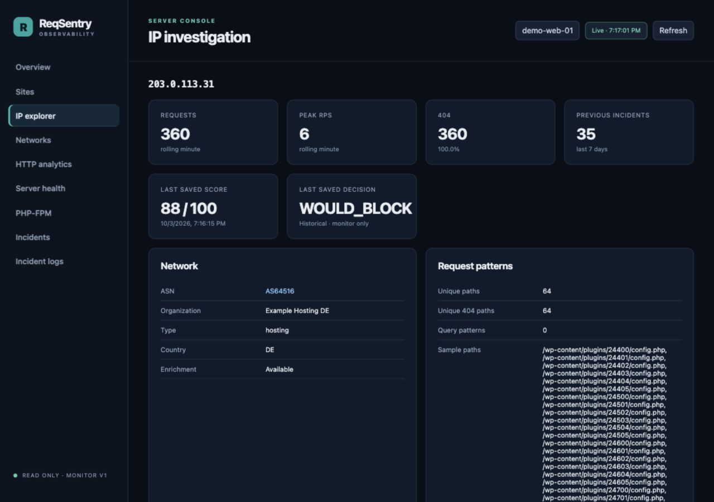
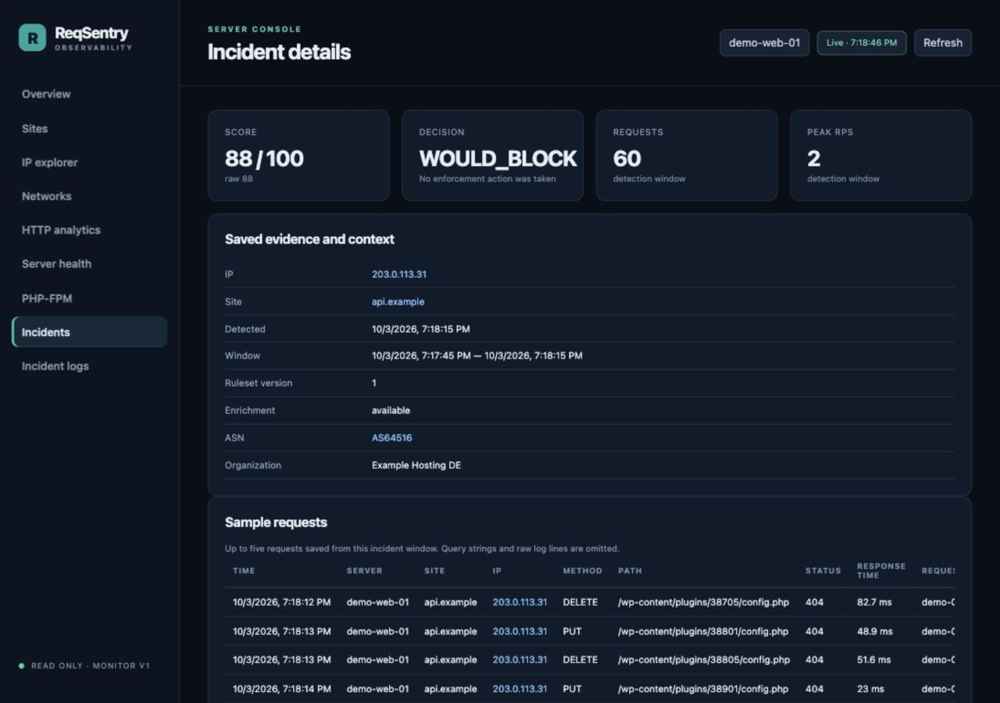
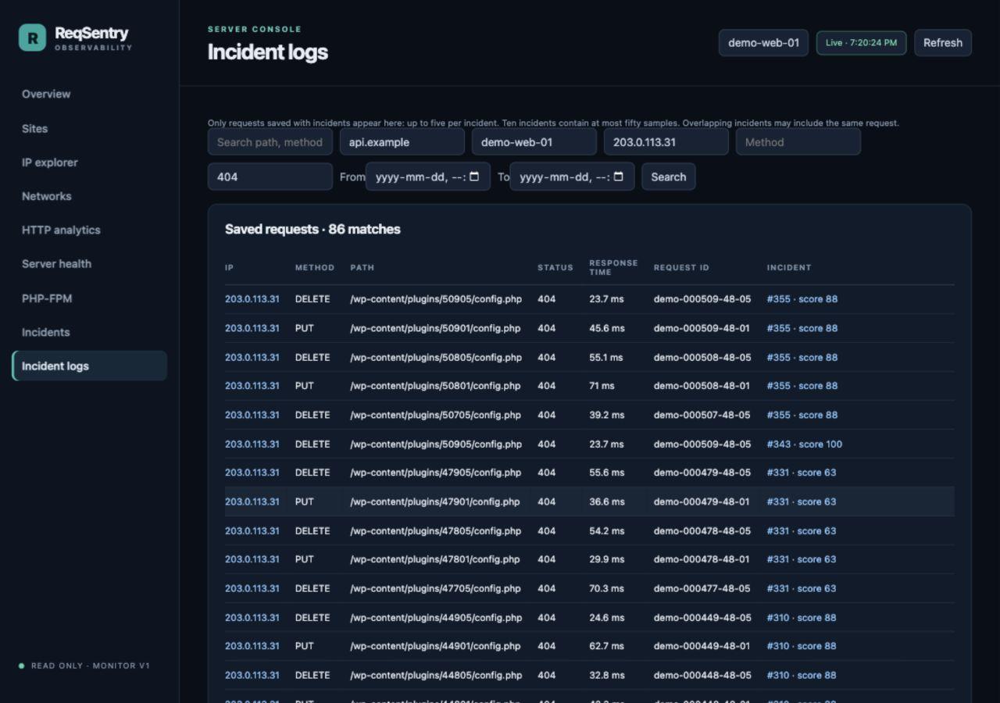

<p align="center">
  
</p>

<h1 align="center">ReqSentry</h1>
<p align="center"><strong>Understand suspicious web traffic. Keep the evidence.</strong></p>
<p align="center">Log monitoring engine · Clear CLI reports · Optional notifications and dashboard</p>
<p align="center">
  <a href="#monitor-from-the-command-line">CLI</a> ·
  <a href="#optional-dashboard">Dashboard</a> ·
  <a href="#try-the-demo">Try the demo</a> ·
  <a href="configs/example.yaml">Configuration</a> ·
  <a href="docs/install.md">Linux installation</a> ·
  <a href="LICENSE">MIT license</a>
</p>

ReqSentry follows web-server logs in real time, groups requests by client and site, and turns suspicious behavior into scored incidents. Use the monitoring engine and CLI to identify suspicious IPs, inspect the evidence behind each score, and report findings locally or through notifications. The dashboard is optional and disabled by default.

**V1 is monitor-only.** `WOULD_BLOCK` means the evidence meets the configured review threshold. ReqSentry does not block requests, change firewall or web-server rules, or call an enforcement provider.

## Monitor from the command line

Build with **Go 1.26+**, then copy the [complete commented config](configs/example.yaml) to `/etc/reqsentry/config.yaml` and set the server name, access-log paths, and SQLite path. Enable only the optional features you need. The [Linux installation guide](docs/install.md) covers permissions and the included systemd service.

```sh
go build -o reqsentry ./cmd/reqsentry
./reqsentry -config /etc/reqsentry/config.yaml config test
./reqsentry -config /etc/reqsentry/config.yaml
```

The last command runs the engine in the foreground. For an installed service, use `sudo systemctl enable --now reqsentry`. It follows new requests across configured sites, detects suspicious behavior, stores scored incidents, and sends alerts to enabled destinations. First-time monitoring starts at the end of existing log files; use `replay` for older requests. A missing source or optional integration is reported while other log sources continue.

In another terminal, inspect the engine and its findings:

```sh
reqsentry -config /etc/reqsentry/config.yaml status
reqsentry -config /etc/reqsentry/config.yaml report
reqsentry -config /etc/reqsentry/config.yaml -ip 203.0.113.31 -details report
reqsentry -config /etc/reqsentry/config.yaml -site shop.example -limit 50 report
reqsentry -config /etc/reqsentry/config.yaml -json report
```

Flags go **before** the command. Run reports as the service account or another account with access to the data. `status` shows source availability, parsed/malformed counts, lag, and notification delivery health. `report` shows the latest retained incident windows; `-details` adds signal weights and up to five saved requests. `-json` keeps structured output available for automation.

Example analysis of synthetic traffic:

```text
Historical log analysis — MONITOR ONLY
Decisions describe the incident window; no IP is blocked. Times are UTC.

DETECTED             CLIENT IP                               SITE                     SCORE DECISION     REQUESTS  PEAK/s COUNTRY
2026-10-04 12:00:29  203.0.113.31                            shop.example               100 WOULD_BLOCK       600      20 —
  Evidence: HIGH_404_RATE, HIGH_404_DIVERSITY, PATH_ENUMERATION, HIGH_REQUEST_RATE, SUSTAINED_HIGH_RATE, METHOD_404_SCAN, AUTOMATED_USER_AGENT
```

This is an incident decision, not a permanent IP reputation or live blocklist. A client can have different scores across sites and time windows. Missing country data stays unavailable; normal traffic does not produce a saved incident under the default rules.

### Operations

| Action | Command after `reqsentry -config /etc/reqsentry/config.yaml` |
| --- | --- |
| List found issues | `report` — use `-ip`, `-site`, `-limit`, or `-details` before the command |
| Inspect monitoring and delivery | `status` — add `-json` for the full heartbeat |
| Update MaxMind | `maxmind update` — checks the configured scheduler and respects its due time |
| Preview a Slack incident offline | `notifications preview` — synthetic data, no send |
| Test notification delivery | `notifications test NAME` — explicitly sends a synthetic test |
| Enable / disable the UI | `ui enable` / `ui disable` — saves config; restart the service to apply |
| Preview all local data cleanup | `data preview` |
| Clean all collected data | Stop the service, then `-confirm data clean` |

Cleanup removes the configured SQLite database, its sidecars, incident/error/minute history, saved offsets and scheduler state, and configured ReqSentry output files including managed archives/quarantines. It preserves configuration, source web-server/application logs, MaxMind databases, and messages already sent to external services. It refuses while an engine or local database operator holds the data lock. Clearing offsets means the next start follows new requests from EOF.

UI toggles preserve config comments, ownership, permissions, and existing access rules. First-time enablement adds a loopback allowlist; configured listeners/access rules stay in place. Use `sudo systemctl restart reqsentry` after a toggle. The [CLI guide](docs/cli.md) has complete maintenance examples and credential handling.

## Optional notifications

Send incident summaries to **Slack**, **Microsoft Teams Workflows**, or **AWS SNS**. Each destination has independent filters, cooldowns, bounded queues, and retries. Local monitoring does not wait for provider delivery.

The incident message includes the server, site, client IP, analysis window, request count, peak rate, up to four evidence codes, score/decision, and a monitor-only notice. Full evidence stays in the CLI report and saved incident.

Preview this message without a Slack account:

```sh
reqsentry -config /etc/reqsentry/config.yaml notifications preview
```

For Slack, uncomment `output.slack` in [the config example](configs/example.yaml), reference the environment variable or systemd credential holding the webhook, and send a test explicitly:

```sh
reqsentry -config /etc/reqsentry/config.yaml notifications test legacy-slack
```

Named destinations use their configured name; omit the name when exactly one destination is enabled. The test reports provider acceptance, so verify receipt separately. Secrets stay outside YAML and Git. See [notifications](docs/notifications.md) for Slack, Teams, and SNS setup.

## Retention and configuration

The [configuration reference](configs/example.yaml) lists every supported setting. Uncomment optional settings to enable the features you need. ReqSentry loads the file selected by `-config`.

Investigation history and ReqSentry's configured output files default to a **four-day** ceiling. Increase or decrease it in config:

```yaml
database:
  path: /var/lib/reqsentry/reqsentry.db
  retention:
    max_age: 96h # Four days; 48h = two days, 240h = ten days.
```

Original input logs, external backups, journald copies, and delivered Slack/Teams/SNS messages have separate retention. Cleanup is periodic and can lag under storage failures; reads immediately exclude expired history. See [storage and retention](docs/storage-output.md).

## Analyze existing logs

Use `replay` to evaluate requests recorded before ReqSentry was running. It uses the same detection engine and recorded timestamps, prints readable findings and a summary, and sends no alerts:

```sh
reqsentry replay /path/to/access.log
reqsentry -config /etc/reqsentry/config.yaml replay /var/log/nginx/access.log
reqsentry -config /etc/reqsentry/config.yaml -json replay /var/log/nginx/access.log
reqsentry -config /etc/reqsentry/config.yaml -limit 20 preview /var/log/app/access.jsonl
```

Replay results go to the terminal; they do not change saved offsets or import into database/dashboard history. Without a default config, replay uses built-in monitor defaults and a filename-derived site. Configure formats/profiles before replaying structured sources. Historical host health is not reconstructed and MaxMind enrichment is disabled, so scores can differ from live monitoring. `preview` prints bounded, redacted JSON samples. See [replay formats and limits](docs/structured-logs.md#preview-replay-and-limits).

## What it does

| Capability | What you can investigate |
| --- | --- |
| **Live monitoring across sites** | Follow multiple Nginx/Apache combined, JSON, logfmt, or mapped ECS log sources; spot clients reaching several virtual hosts. |
| **CLI reports** | Read recent IP findings, filter by IP/site, inspect signal weights and saved requests, or export JSON for automation. |
| **Explainable scoring** | Inspect 404 rates/diversity, path/query enumeration, method scans, burst/sustained rates, User-Agents, redirects, request cost, and server impact. Every incident retains its signal weights and ruleset version. |
| **Error correlation** | Associate web-server/application failures using request IDs, trace IDs, client/path/time, or site/server context. Association strength is labeled; errors alone do not increase a score. |
| **Incident request search** | Save up to five normalized requests per incident. Filter by server, site, IP, method, status, date, path, or request ID and follow the original score. Queries are omitted from saved request samples. |
| **Server and application context** | Sample Linux CPU/load/memory, optionally poll local PHP-FPM pools, and enrich clients from local MaxMind databases. Missing or stale values stay unavailable. |
| **Optional notifications** | Route incidents and recurring operational alerts to Slack, Microsoft Teams Workflows, or AWS SNS, with independent filters, cooldowns, bounded queues, and retries. |
| **Local history and recovery** | Store SQLite incidents and minute history, optional JSONL/operational files, rotation-aware log positions, and opt-in bounded crash recovery. |
| **Controlled retention** | Default to **four days** for investigation history and ReqSentry's configured output files. Increase or decrease the shared ceiling in configuration. |

The dashboard is read-only, embedded in the Go binary, and supports site/IP/network exploration, HTTP analytics, health views, incident filters, and live updates. It requires no separate database service or frontend runtime.



## How to read a score

Default decision thresholds are configurable:

| Decision | Score | Meaning |
| --- | ---: | --- |
| `NORMAL` | Below 30 | No saved incident under the default rules. |
| `WATCH` | 30–59 | Behavior worth watching. |
| `SUSPICIOUS` | 60–79 | Evidence needs investigation. |
| `WOULD_BLOCK` | 80–100* | Meets the monitor-only blocking review threshold. |

\* `WOULD_BLOCK` also requires a strong signal or signals from at least two behavioral groups. A high score without that corroboration remains `SUSPICIOUS`. Scores summarize configured detection evidence; they are not probabilities. A network or country is not deemed malicious because one client generated an incident.

In the demo, `203.0.113.31` has fictional Germany/hosting metadata and repeatedly enumerates numeric paths with non-GET 404s. Its saved site incident reaches `WOULD_BLOCK` using the default rules. Normal browser clients are present alongside less severe incidents.

## Optional dashboard

<p align="center">
  <a href="docs/images/dashboard-walkthrough.gif"></a>
</p>

The embedded dashboard is an optional, read-only investigation view. Enable it when useful; the engine, CLI reports, and notifications work with it disabled. Follow live traffic into a site, investigate a client, inspect its score and error context, then search the incident's saved requests.

The screenshots and animation use synthetic traffic, fictional country/ASN labels, and simulated PHP-FPM counters.

<table>
  <tr>
    <td><a href="docs/images/dashboard-overview.png"></a><br><strong>Live overview</strong><br>Traffic, errors, resource usage, and decisions across sites.</td>
    <td><a href="docs/images/dashboard-ip-investigation.png"></a><br><strong>IP investigation</strong><br>Network context, request patterns, and saved scoring evidence.</td>
  </tr>
  <tr>
    <td><a href="docs/images/dashboard-incident.png"></a><br><strong>Explainable incidents</strong><br>Review the signals and evidence behind a decision.</td>
    <td><a href="docs/images/dashboard-incident-logs.png"></a><br><strong>Focused log search</strong><br>Search saved incident requests without indexing every access log.</td>
  </tr>
</table>

## Try the demo

With **Go 1.26+** and **Python 3.9+**, from the repository root:

```sh
python3 scripts/demo.py
```

Open **[localhost:18092](http://localhost:18092)**. Allow 30 seconds for the first scored windows and about two minutes for traffic trends. The demo runs for five minutes; Ctrl+C stops it. It builds the daemon, creates fresh synthetic log files, and starts a local PHP-FPM status fixture. Demo files are stored under `dev-data/demo/`.

```sh
# Longer run or an alternative port:
python3 scripts/demo.py --duration 900 --port 18095
```

Use Linux for live CPU/load/memory metrics. Other hosts can exercise the log pipeline and dashboard while unsupported host measurements remain unavailable. See the [demo guide](docs/demo.md) for options and traffic patterns.

### Exercise real Nginx with Docker

Docker Compose provides four local Nginx sites, ReqSentry, and k6 traffic generation:

```sh
docker compose up -d --build
docker exec reqsentry-k6 k6 run /scripts/scenarios/normal.js
docker exec reqsentry-k6 k6 run /scripts/scenarios/cross-site.js
```

Open the **[dashboard](http://localhost:8090)** and the example sites: [shop.example](http://localhost:8081), [api.example](http://localhost:8082), [docs.example](http://localhost:8083), and [blog.example](http://localhost:8084). These are local labels; no DNS setup is needed. Ports bind to host loopback, and generated logs/state persist under `dev-data/`.

The standard Compose fixture uses the actual k6 source IP. The synthetic walkthrough demo deliberately supplies many fictional identities. See [development operations](docs/development.md) and [all k6 scenarios](tests/k6/README.md).

## Development

Run the Go checks from the repository root:

```sh
go test -race ./...
go vet ./...
```

CI includes Go and dashboard regressions, configuration checks, dependency audits, and container vulnerability scans. See [development](docs/development.md) and [testing](docs/validation.md) for the full workflow.

## Documentation

| Topic | Guide |
| --- | --- |
| Demo and example traffic | [Demo](docs/demo.md) |
| Engine, CLI reports, and maintenance commands | [CLI guide](docs/cli.md) · [Linux install](docs/install.md) |
| Every supported configuration setting | [Configuration reference](configs/example.yaml) |
| Dashboard access, API, and data semantics | [Dashboard](docs/dashboard.md) |
| Nginx/Apache and structured log formats | [Access logs](docs/access-logs.md) · [JSON/logfmt/ECS](docs/structured-logs.md) |
| Web/application error evidence | [Error correlation](docs/error-correlation.md) |
| Slack, Teams Workflows, and AWS SNS | [Notifications](docs/notifications.md) |
| Request samples and local retention | [Incident logs](docs/incident-logs.md) · [Storage](docs/storage-output.md) |
| Optional enrichment and pool health | [MaxMind](docs/maxmind.md) · [PHP-FPM](docs/php-fpm.md) |
| Development, architecture, and testing | [Development](docs/development.md) · [Architecture](docs/architecture.md) · [Testing](docs/validation.md) |

## License

ReqSentry is licensed under the [MIT License](LICENSE). Third-party dependencies and fixtures retain their respective licenses and notices.
